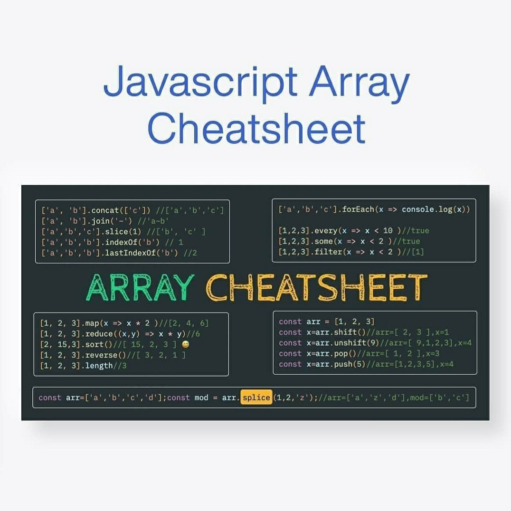
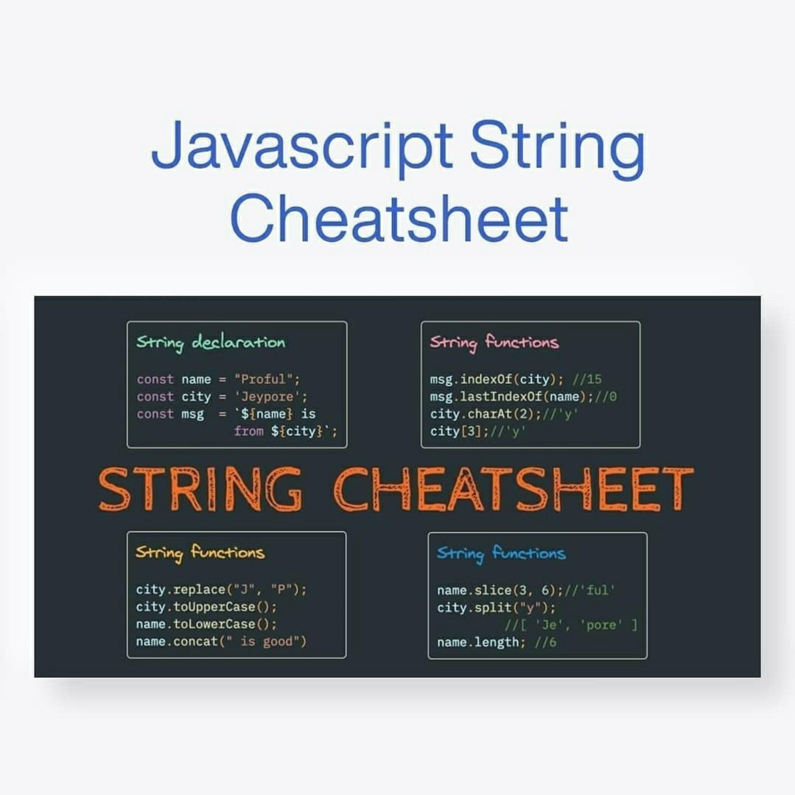
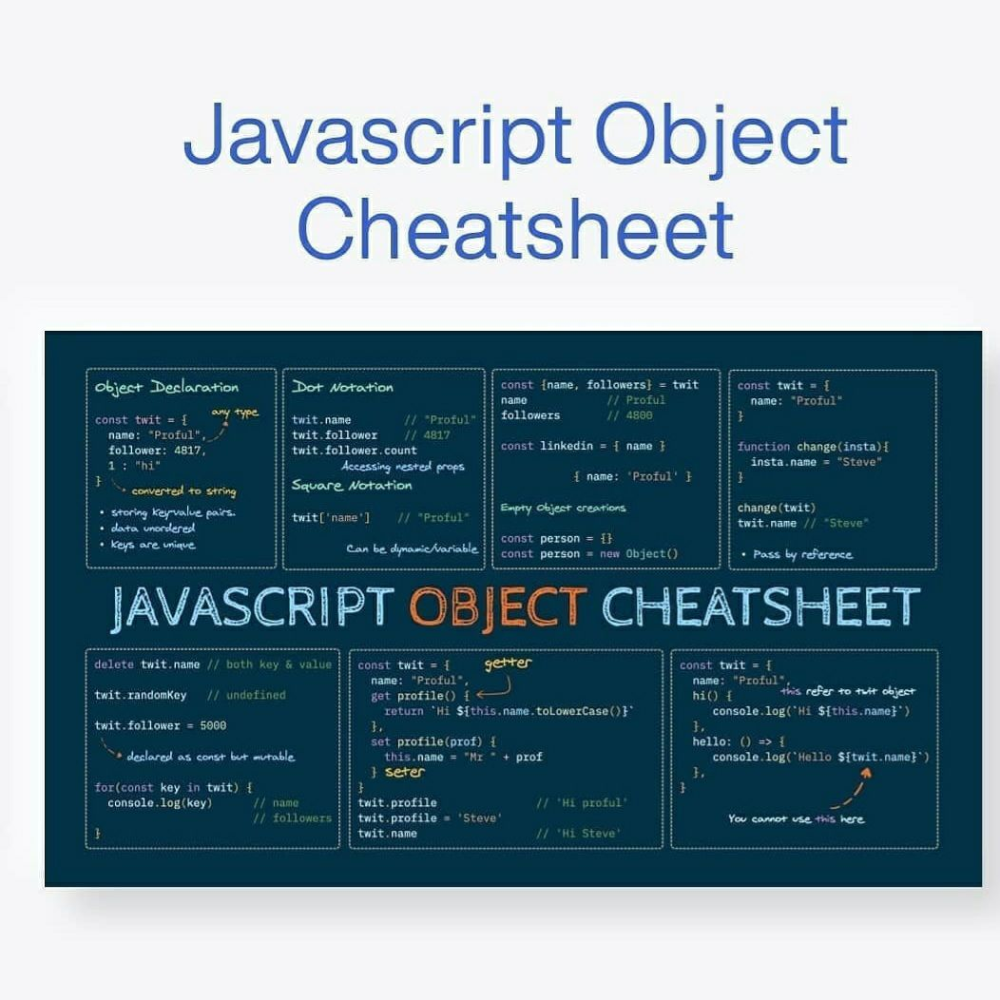
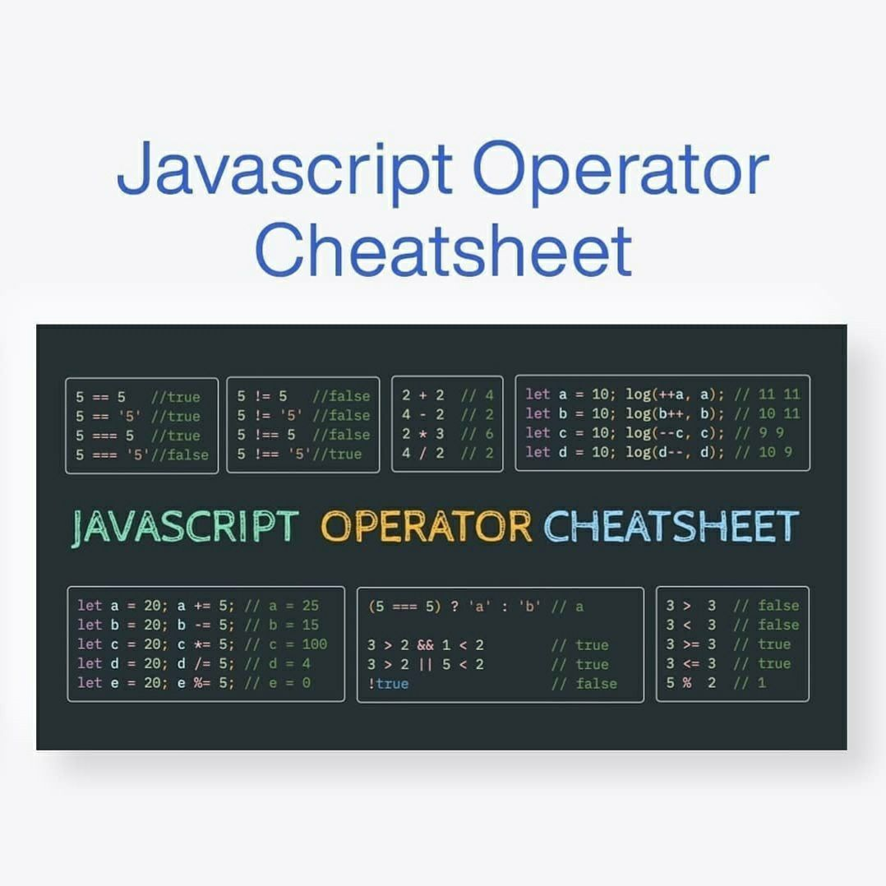

# JavaScript_exercises

    <h3>This is a collection of modern My Practice Set code challenges on JavaScript suitable for</h3>
    <h4>Interviewees | Interviewers | Knowledge test | Practice</h4>
	

    

    

    

    

    

